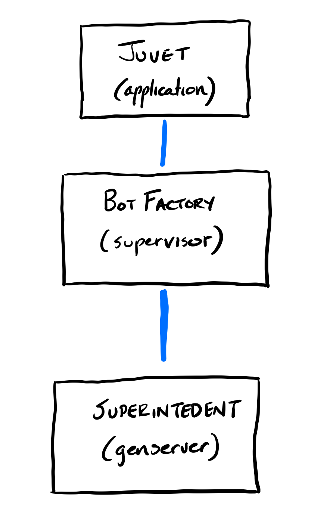
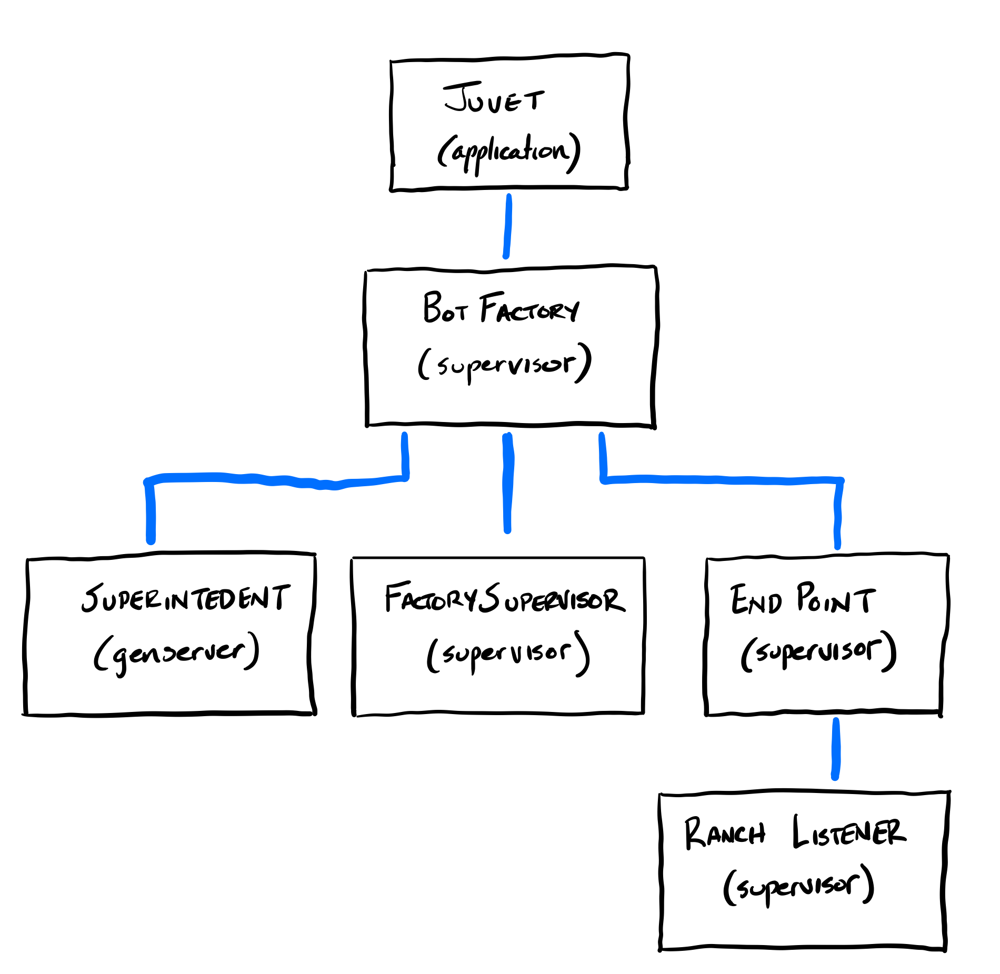
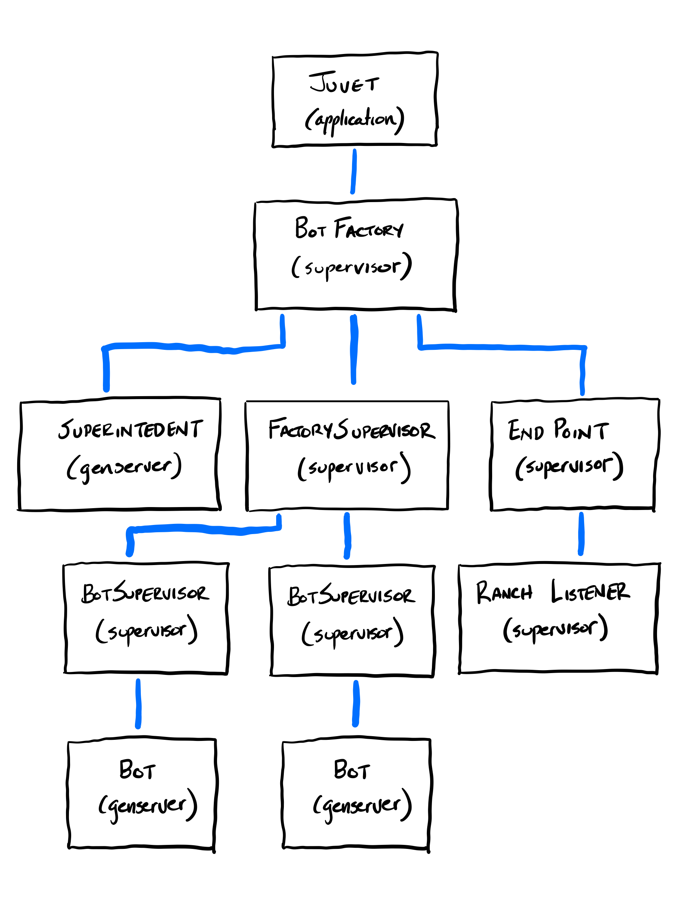
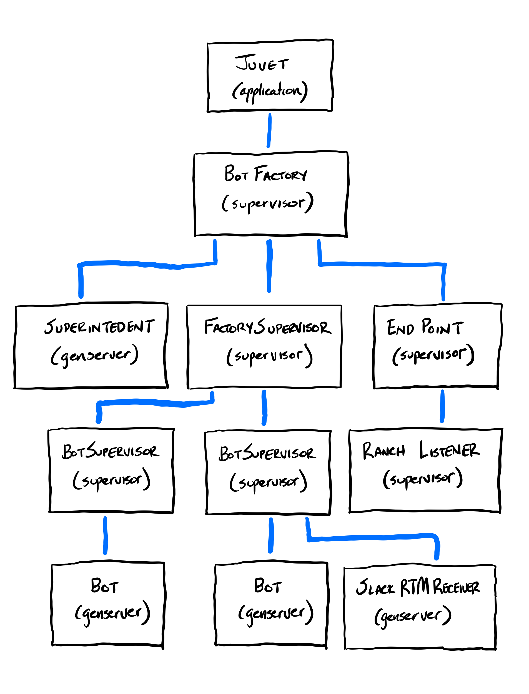

I spent the better half of the last month researching, architecting and implementing the process architecture for [Juvet](https://github.com/juvet/juvet). This is an important step when building Elixir applications since every bot in Juvet will be a process with state.

<!-- end -->

A lot of the concepts in this architecture was modeled after the logic within [The Little Elixir & OTP Guidebook](https://www.manning.com/books/the-little-elixir-and-otp-guidebook).

Starting the Juvet Application, the following processes are started up:



- `Juvet (Application)` The `Application` module for the whole Juvet application. This just starts the `BotFactory` `Supervisor` and passes the application configuration for `Juvet` as the only argument.
- `BotFactory (Supervisor)`A `Supervisor` that is started by the `Juvet` `Application`. It receives the application configuration as a `Keyword` list as it’s only argument. The `BotFactory` is used to create and start additional bot processes through the `Superintendent`. On initialize, the `BotFactory` starts a `Superintendent` as it’s only child using the `one_for_all` strategy, passing in the config. If the `Superintendent` process dies, then everything else should be restarted since it is the brains of the factory.
- `Superintendent (GenServer)` A `GenServer` process that is started by the `BotFactory` with the application config as it’s only argument. The `Superintendent` is the “brains” of the factory and helps it keep running. If the `Superintendent` is started with valid configuration, it allows the rest of the factory to start up. It starts an `Endpoint` process and a `FactorySupervisor` under the `BotFactory` `Supervisor` if the configuration is valid.

If the configuration is valid, then the `FactorySupervisor` and `Endpoint` are started up under the `BotFactory` `Supervisor`:



- `FactorySupervisor (Supervisor)` A `Supervisor` that will supervise all the bot processes within the factory. It can add bot processes (under a `BotSupervisor`) with it’s functions.
- `Endpoint (Supervisor)`This `Supervisor` starts a [`Ranch Listenter`](https://github.com/ninenines/ranch) which is responsible for receiving incoming bot messages from the platforms. For example, Slack will send it’s events, actions, and menu requests to the `ranch_listener` child process.
- `EndpointRouter (Ranch Listener)` The `Module` that sets up the routes to the platform endpoints based on the application configuration.

A bot can be added to the supervision tree with the following function:

```language-elixir
{:ok, bot} = Juvet.create_bot(:my_bot_1)
```

When a bot is added to the process architecture, the process architecture now adds a `BotSupervisor` and a `Bot` underneath the `FactorySupervisor`.



- `BotSupervisor (Supervisor)` A `Supervisor` that supports the `Bot` process and any additional processes like a `SlackRTMReceiver` which can listen for incoming messages on a websocket for that particular bot process.
- `Bot (GenServer)` A `GenServer` process that handles incoming and outgoing messages to and from various services. It holds onto conversations within it’s own state for each individual platform and team.

If the bot is connected to the Slack RTM, a listener is created under the `BotSupervisor` and next to the `Bot` process. This can be added to the `BotSupervisor` with the following function:

```
Juvet.connect_bot(bot, :slack_rtm, %{token: "MY_TOKEN", team_id: "T123456"})
```



- `SlackRTMReceiver (GenServer)` A `GenServer` process that connects to Slack via it’s [RTM API](https://api.slack.com/rtm) and routes incoming and outgoing messages to the `Bot`.

Time will tell if this is the correct foundation to build an army of bots on. If this was helpful to you or you have suggestions, please email me at jamie AT brilliantfantastic.com. If you are interested in helping build an army of bots, check out my [GitHub sponsor page](https://github.com/sponsors/jwright).
